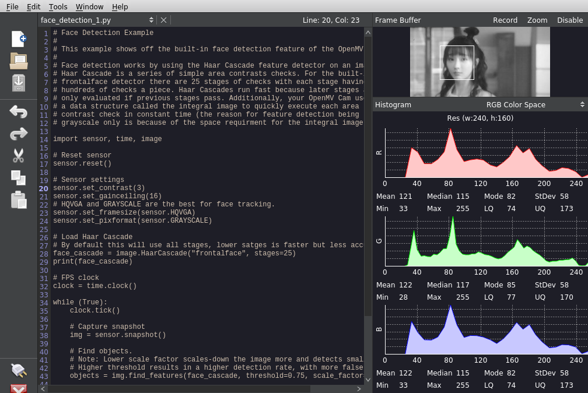

# raspberry pi openmv-ide

Building and packaging the [openmv-ide](https://github.com/openmv/openmv-ide) on the raspberry pi.

 

## Installation

Download the binary from [releases](https://github.com/koendv/openmv-ide-raspberrypi/releases) and execute. 

On 32 bit systems:

```
$ chmod +x OpenMV_IDE-2.6.9-armhf.AppImage
$ ./OpenMV_IDE-2.6.9-armhf.AppImage
```

On 64 bit systems:

```
$ chmod +x OpenMV_IDE-2.6.9-aarch64.AppImage
$ ./OpenMV_IDE-2.6.9-aarch64.AppImage
```

If you like this, maybe you want to buy me a cup of tea:

[](https://ko-fi.com/Q5Q03LPDQ)

## Building

Install prerequisites:
```
sudo apt-get update
sudo apt-get install qt5-default qtbase5-private-dev qtdeclarative5-dev libqt5serialport5-dev qttools5-dev-tools chrpath p7zip-full
```
Clone sources:
```
mkdir src
cd src
git clone --recursive https://github.com/openmv/openmv-ide.git
```
Remove nag screens:
```
cd ~/src/openmv-ide/qt-creator/
wget https://raw.githubusercontent.com/koendv/openmv-ide-raspberrypi/main/openmv-ide.patch
patch -p1 < openmv-ide.patch
```
Build:
```
cd ~/src/openmv-ide
./make.py
```
Create desktop shortcut and icon:
```
mkdir -p appdir/usr
cat > appdir/openmv-ide.desktop <<EOD
[Desktop Entry]
Type=Application
Exec=openmvide
Path=/usr/bin/openmvide
Icon=openmv-ide
Name=OpenMV IDE
GenericName=The IDE of choice for OpenMV Cam Development.
Terminal=false
Categories=Development;IDE;
MimeType=text/x-python;
X-AppImage-Version=2.6.9
EOD
cp bin/openmv.png appdir/openmv-ide.png
```

### On 32 bit systems:

```
7z x -oappdir/usr openmv-ide-linux-arm-2.6.9-installer-archive.7z
```

Create AppImage. From *https://github.com/AppImage/AppImageKit/releases/* download *AppRun-armhf* and *appimagetool-armhf.AppImage*
```
cp ~/Downloads/AppRun-armhf appdir/AppRun
chmod +x appdir/AppRun
~/Downloads/appimagetool-armhf.AppImage ./appdir
```
and test:
```
./OpenMV_IDE-armhf.AppImage
```

### On 64 bit systems:

```
7z x -oappdir/usr openmv-ide-linux-arm64-2.6.9-installer-archive.7z
```

Create AppImage. From *https://github.com/AppImage/AppImageKit/releases/* download *AppRun-aarch64* and *appimagetool-aarch64.AppImage*
```
cp ~/Downloads/AppRun-aarch64 appdir/AppRun
chmod +x appdir/AppRun
~/Downloads/appimagetool-aarch64.AppImage ./appdir
```
and test:
```
./OpenMV_IDE-aarch64.AppImage
```

## Hardware

Notes about the camera hardware I'm using with OpenMV.

- [Mini-STM32H7 board](https://www.aliexpress.com/item/1005001475058305.html) with 0.96" LCD screen and OV7725 camera. Runs micropython/openmv (Open Machine Vision).
- Installation [manual](https://github.com/WeActTC/MiniSTM32H7xx)
- How to [install the LCD](https://m.bilibili.com/video/av286164536)
- camera [firmware](https://gitee.com/WeAct-TC/MiniSTM32H7xx/tree/master/SDK/openmv/Firmwares/)
- [tool](https://gitee.com/WeAct-TC/MiniSTM32H7xx/tree/master/Soft) to upload firmware to the camera
- [3d-printable box](https://github.com/koendv/weact-mini-stm32h7xx-box/) for the camera
- How to modify an [ov2640 camera module for infrared](https://marksbench.com/electronics/removing-ir-filter-from-esp32-cam/)
- [VL53L0X](https://github.com/ramithuh/OpenMV-VL53L0X) laser distance sensor


*not truncated*
