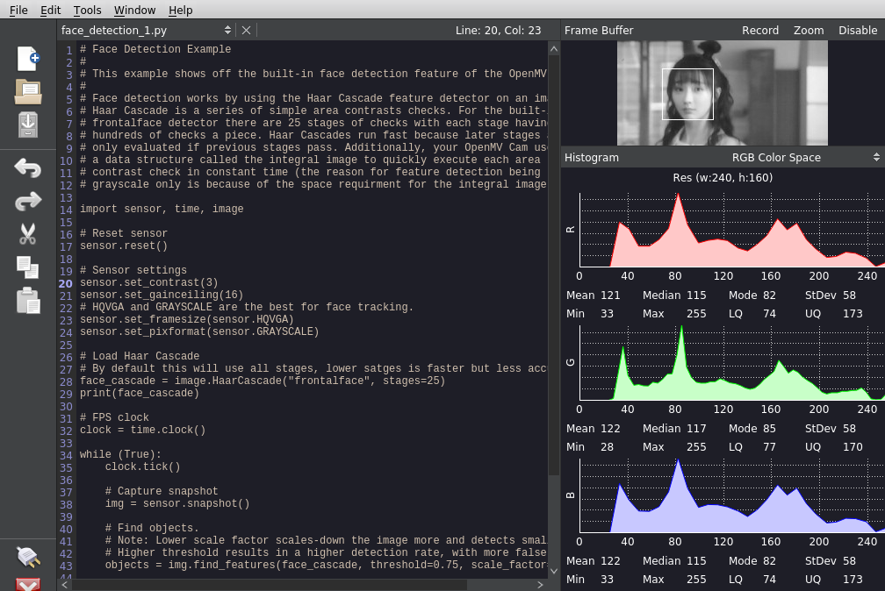

# raspberry pi openmv-ide

Building and packaging the [openmv-ide](https://github.com/openmv/openmv-ide) on the raspberry pi for *raspios-buster-arm64*

 

## Installation

Download the binary from [releases](https://github.com/koendv/openmv-ide-raspberrypi/releases) and install:

```
apt-get update
apt-get install p7zip-full
mkdir -p /opt/openmv-ide
cd /opt/openmv-ide
7z x openmv-ide-linux-arm64-2.6.6-installer-archive.7z
```

To run, type:
```
$ /opt/openmv-ide/bin/openmvide
```

## Building

Install prerequisites:
```
sudo apt-get update
sudo apt-get install qt5-default qtbase5-private-dev qtdeclarative5-dev libqt5serialport5-dev qttools5-dev-tools chrpath p7zip-full
```
Clone sources:
```
mkdir src
cd src
git clone --recursive https://github.com/openmv/openmv-ide.git
```
Remove nag screens:
```
cd ~/src/openmv-ide/qt-creator/
patch -p1 < ../../openmv-ide.patch
```
Build:
```
cd ~/src/openmv-ide
./make.py
```
## Hardware

- [camera](https://www.aliexpress.com/item/1005001475058305.html)
- [firmware](https://gitee.com/WeAct-TC/MiniSTM32H7xx/tree/master/SDK/openmv/Firmwares/)
- [upload tool](https://gitee.com/WeAct-TC/MiniSTM32H7xx/tree/master/Soft)
- [mounting lcd and camera](https://m.bilibili.com/video/av286164536)

not truncated
